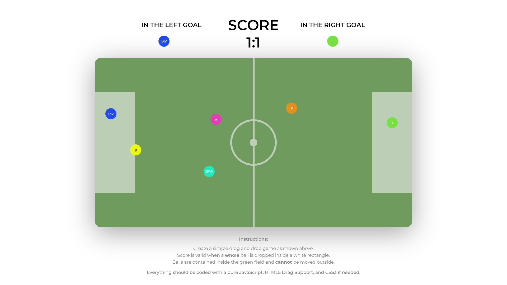

# Js Developer test task

> Building a Javascriopt Drag and Drop game

Instructions:

- [x] Create a simple drag and drop game as shown above
- [ ] Score is valid when a whole ball is dropped inside a white rectangle.
- [x] Balls are contained inside the green field and cannot be moved outside
- [x] Everything should be coded with a pure JavaScript, HTML5 Drag Support, and CSS3 if needed.
